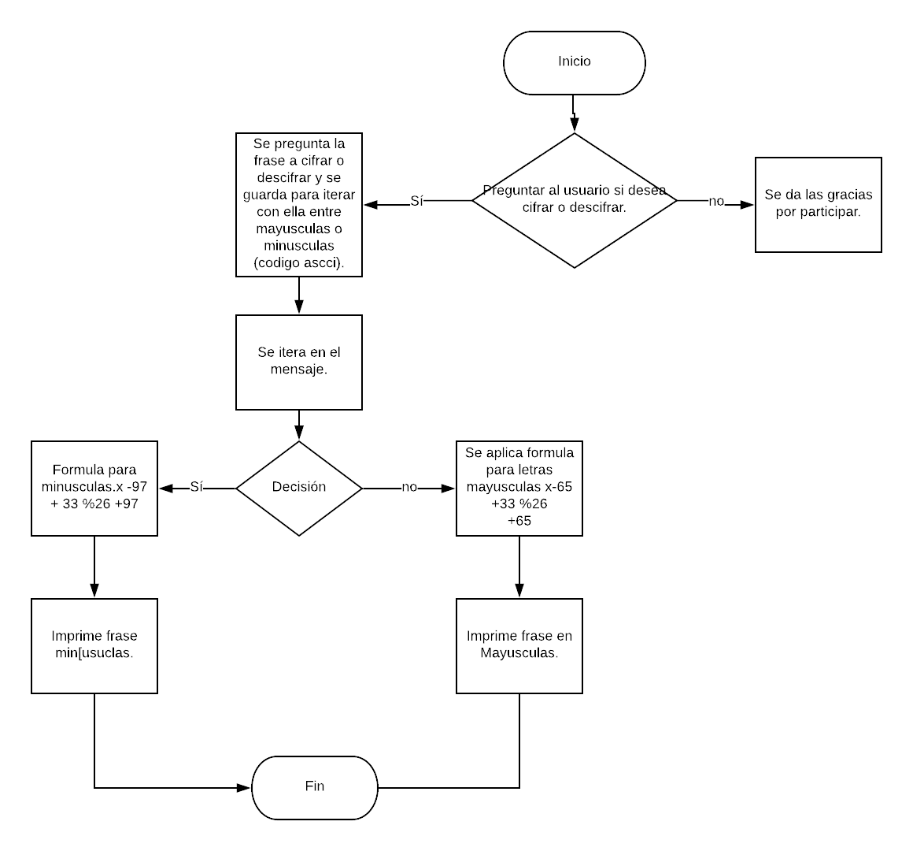

#Cifrado Cesar

##Descripción
Supongamos que nos sentimos de tiempo libre, y queremos, con algunos de nuestros amigos, enviarnos mensajes secretos.
Esta es una herramienta para lograrlo, ya que no solo nos ayudará a descifrarlos, sino a descifrarlos y construirlos.

Crea una función mediante la cual podremos lograr introducir una frase o palabra, y te dará tu código secreto, o bien, la otra cara de la moneda, que al introducir tu clave, pueda descifrarla.

##Pseudocódigo
1. Preguntar al usuario por medio de un prompt, si desea cifrar o descifrar.
2. Pedir al usuario la palabra o frase que desea, y guardarla en una variable para poder iterar con ella.
3. Una vez iterando y clasificando entre letras mayúsuclas y minúsculas (usando el código ascci), daremos el cifrado cesar.
4. Si bien, el usuario desea descifrar, pasaremos a iterar con el código para descifrar y nos proporcionará nuestro mensaje descifrado.

##Diagrama de flujo.
A continuación, se da el diagrama de flujo del programa.

